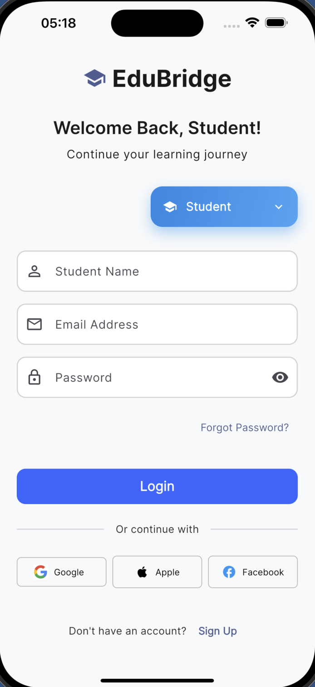
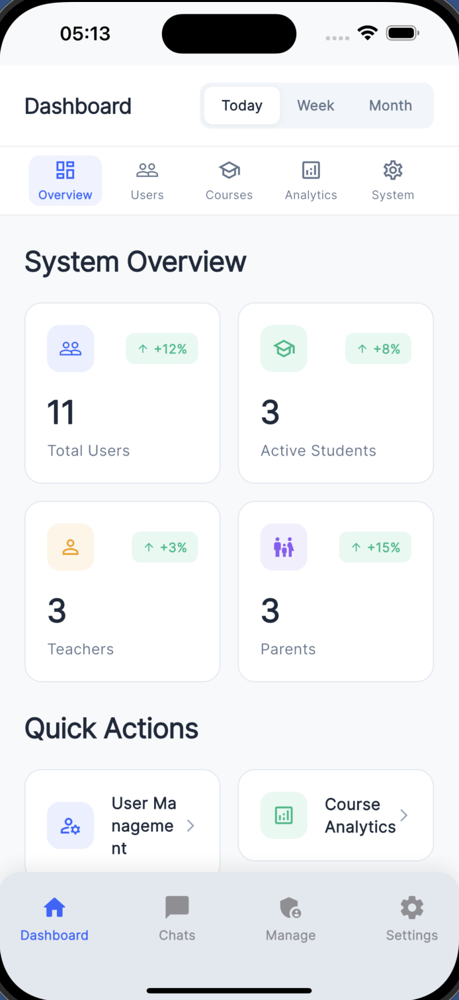
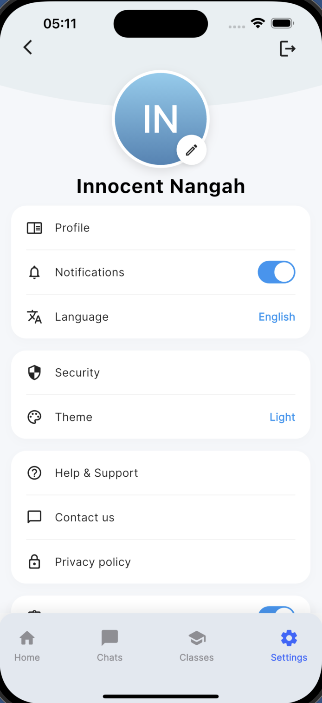
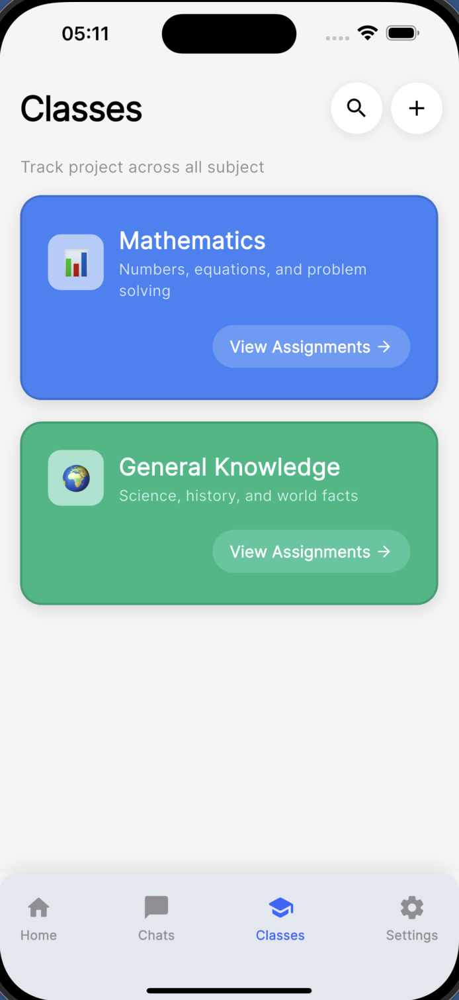
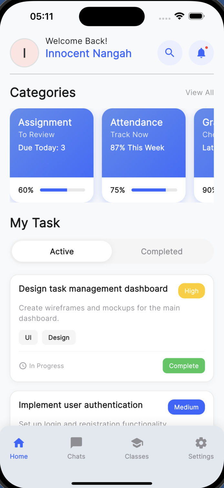

# EduBridge 🎓

A comprehensive educational platform built with Flutter that connects students, teachers, parents, and administrators in a unified learning environment.

## 📱 Screenshots

| Login Screen | Admin Dashboard | Setting Screen | Classes Screen | Home Screen |
|--------------|----------------|----------------|-------------|-------------|
|  |  |  |  | 


## ✨ Features

### 🔐 Authentication System
- Multi-role login (Student, Teacher, Parent, Admin)
- Email/Password authentication
- Google Sign-In integration
- Email verification
- Password reset functionality
- Role-based access control

### 👨‍🎓 Student Features
- View assignments and due dates
- Submit assignments with file uploads
- Real-time chat with teachers and classmates
- Track academic progress
- Access class materials

### 👩‍🏫 Teacher Features
- Create and manage assignments
- Grade student submissions
- Communicate with students and parents
- Manage class rosters
- Upload and share resources

### 👨‍👩‍👧‍👦 Parent Features
- Monitor child's academic progress
- Communicate with teachers
- View assignments and grades
- Receive notifications about child's activities

### 🛠️ Admin Features
- User management system
- System-wide notifications
- Analytics and reporting
- Platform configuration

### 💬 Communication
- Real-time messaging system
- Group chats for classes
- File sharing capabilities
- Push notifications

## 🚀 Getting Started

### Prerequisites

Before running this project, make sure you have:

- [Flutter SDK](https://flutter.dev/docs/get-started/install) (version 3.9.2 or higher)
- [Dart SDK](https://dart.dev/get-dart) (included with Flutter)
- [Android Studio](https://developer.android.com/studio) or [VS Code](https://code.visualstudio.com/)
- [Firebase CLI](https://firebase.google.com/docs/cli) for Firebase setup
- A Firebase project with the following services enabled:
  - Authentication
  - Firestore Database
  - Storage
  - Cloud Messaging (optional)

### Installation

1. **Clone the repository**
   ```bash
   git clone <repository-url>
   cd edu_bridge_01
   ```

2. **Install dependencies**
   ```bash
   flutter pub get
   ```

3. **Firebase Setup**
   
   a. Create a new Firebase project at [Firebase Console](https://console.firebase.google.com/)
   
   b. Enable the following services:
   - Authentication (Email/Password and Google Sign-In)
   - Firestore Database
   - Storage
   
   c. Download configuration files:
   - For Android: Download `google-services.json` and place it in `android/app/`
   - For iOS: Download `GoogleService-Info.plist` and place it in `ios/Runner/`
   
   d. Configure Firebase for Flutter:
   ```bash
   flutter pub global activate flutterfire_cli
   flutterfire configure
   ```

4. **Configure Firestore Security Rules**
   
   Update your Firestore rules in the Firebase Console:
   ```javascript
   rules_version = '2';
   service cloud.firestore {
     match /databases/{database}/documents {
       match /{document=**} {
         allow read, write: if request.auth != null;
       }
     }
   }
   ```

5. **Run the application**
   ```bash
   flutter run
   ```

### Platform-Specific Setup

#### Android
- Minimum SDK version: 21
- Target SDK version: 34
- Make sure `google-services.json` is in `android/app/`

#### iOS
- Minimum iOS version: 12.0
- Make sure `GoogleService-Info.plist` is in `ios/Runner/`
- Run `cd ios && pod install` if needed

## 🏗️ Project Structure

```
lib/
├── core/                    # Core utilities and constants
│   ├── constants/          # App constants and strings
│   ├── theme/             # App themes and styling
│   ├── utils/             # Utility functions
│   └── widgets/           # Reusable widgets
├── data/                   # Data layer
│   ├── datasources/       # Remote and local data sources
│   ├── models/            # Data models
│   ├── repositories/      # Repository implementations
│   └── services/          # External services
├── domain/                 # Domain layer
│   ├── entities/          # Business entities
│   ├── repositories/      # Repository interfaces
│   └── usecases/          # Business logic
└── presentation/           # Presentation layer
    ├── bloc/              # State management (BLoC)
    ├── pages/             # Screen widgets
    └── widgets/           # UI components
```

## 🧪 Testing

Run the test suite:

```bash
# Run all tests
flutter test

# Run tests with coverage
flutter test --coverage

# Run specific test file
flutter test test/auth_bloc_test.dart
```

## 📦 Dependencies

### Core Dependencies
- `flutter_bloc` - State management
- `firebase_core` - Firebase initialization
- `firebase_auth` - Authentication
- `cloud_firestore` - Database
- `firebase_storage` - File storage
- `google_sign_in` - Google authentication

### UI Dependencies
- `google_fonts` - Typography
- `animate_do` - Animations
- `lottie` - Lottie animations
- `google_nav_bar` - Navigation bar
- `flutter_staggered_animations` - Staggered animations

### Utility Dependencies
- `shared_preferences` - Local storage
- `file_picker` - File selection
- `image_picker` - Image selection
- `url_launcher` - URL handling
- `path_provider` - Path utilities

## 🔧 Configuration

### Environment Variables

Create a `.env` file in the root directory (optional):
```
FIREBASE_PROJECT_ID=your_project_id
FIREBASE_API_KEY=your_api_key
```

### App Constants

Update app constants in `lib/core/constants/app_constants.dart`:
- App name and version
- API endpoints
- Default values

## 🚀 Deployment

### Android
```bash
flutter build apk --release
# or
flutter build appbundle --release
```

### iOS
```bash
flutter build ios --release
```

### Web
```bash
flutter build web --release
```

## 🤝 Contributing

1. Fork the repository
2. Create a feature branch (`git checkout -b feature/amazing-feature`)
3. Commit your changes (`git commit -m 'Add some amazing feature'`)
4. Push to the branch (`git push origin feature/amazing-feature`)
5. Open a Pull Request

## 📝 Code Style

This project follows the [Dart Style Guide](https://dart.dev/guides/language/effective-dart/style). 

Run the linter:
```bash
flutter analyze
```

Format code:
```bash
dart format .
```

## 🐛 Troubleshooting

### Common Issues

1. **Firebase configuration errors**
   - Ensure `google-services.json` and `GoogleService-Info.plist` are properly placed
   - Verify Firebase project settings

2. **Build errors**
   - Run `flutter clean && flutter pub get`
   - Check Flutter and Dart SDK versions

3. **Authentication issues**
   - Verify Firebase Authentication is enabled
   - Check Google Sign-In configuration

## 📄 License

This project is licensed under the MIT License - see the [LICENSE](LICENSE) file for details.

## 👥 Authors

- **Your Name** - *Initial work* - [YourGitHub](https://github.com/yourusername)

## 🙏 Acknowledgments

- Flutter team for the amazing framework
- Firebase for backend services
- Material Design for UI guidelines
- All contributors and testers

---

**EduBridge** - Connecting education, one bridge at a time 🌉